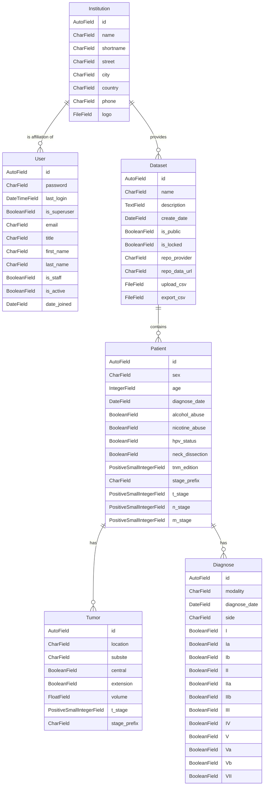

# LyProX ER Diagram

```mermaid
erDiagram
    Institution{
        AutoField id
        CharField name
        CharField shortname
        CharField street
        CharField city
        CharField country
        CharField phone
        FileField logo
    }
    User{
        AutoField id
        CharField password
        DateTimeField last_login
        BooleanField is_superuser
        CharField email
        CharField title
        CharField first_name
        CharField last_name
        BooleanField is_staff
        BooleanField is_active
        DateField date_joined
    }
    Dataset{
        AutoField id
        CharField name
        TextField description
        DateField create_date
        BooleanField is_public
        BooleanField is_locked
        CharField repo_provider
        CharField repo_data_url
        FileField upload_csv
        FileField export_csv
    }
    Patient{
        AutoField id
        CharField sex
        IntegerField age
        DateField diagnose_date
        BooleanField alcohol_abuse
        BooleanField nicotine_abuse
        BooleanField hpv_status
        BooleanField neck_dissection
        PositiveSmallIntegerField tnm_edition
        CharField stage_prefix
        PositiveSmallIntegerField t_stage
        PositiveSmallIntegerField n_stage
        PositiveSmallIntegerField m_stage
    }
    Tumor{
        AutoField id
        CharField location
        CharField subsite
        BooleanField central
        BooleanField extension
        FloatField volume
        PositiveSmallIntegerField t_stage
        CharField stage_prefix
    }
    Diagnose{
        AutoField id
        CharField modality
        DateField diagnose_date
        CharField side
        BooleanField I
        BooleanField Ia
        BooleanField Ib
        BooleanField II
        BooleanField IIa
        BooleanField IIb
        BooleanField III
        BooleanField IV
        BooleanField V
        BooleanField Va
        BooleanField Vb
        BooleanField VII
    }
    Institution||--o{User : "is affiliation of"
    Institution||--o{Dataset : provides
    Dataset||--o{Patient : contains
    Patient||--o{Tumor : has
    Patient||--o{Diagnose : has
```
